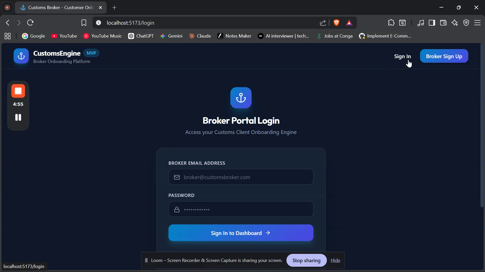
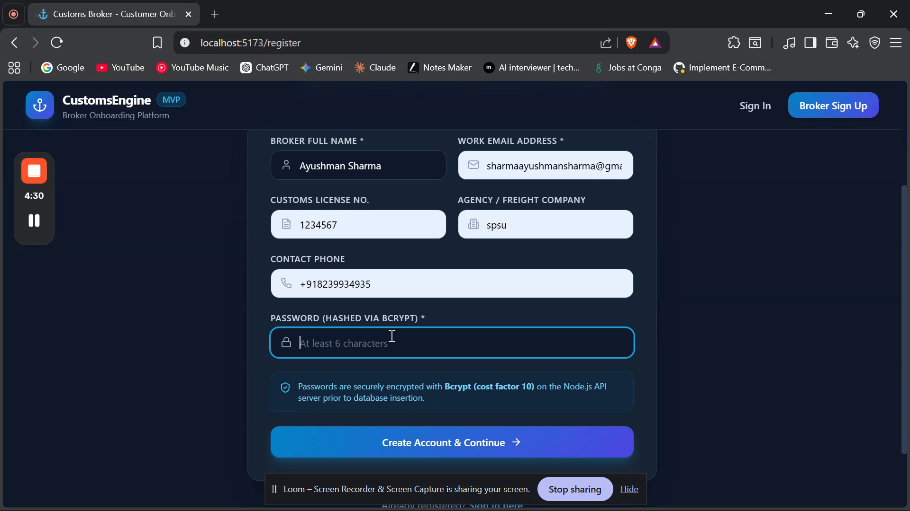
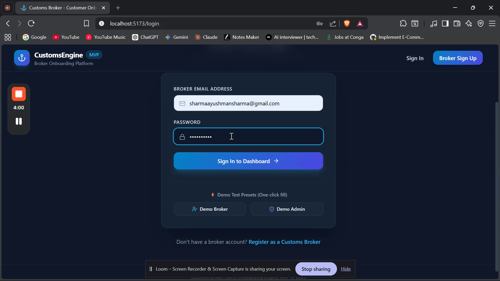
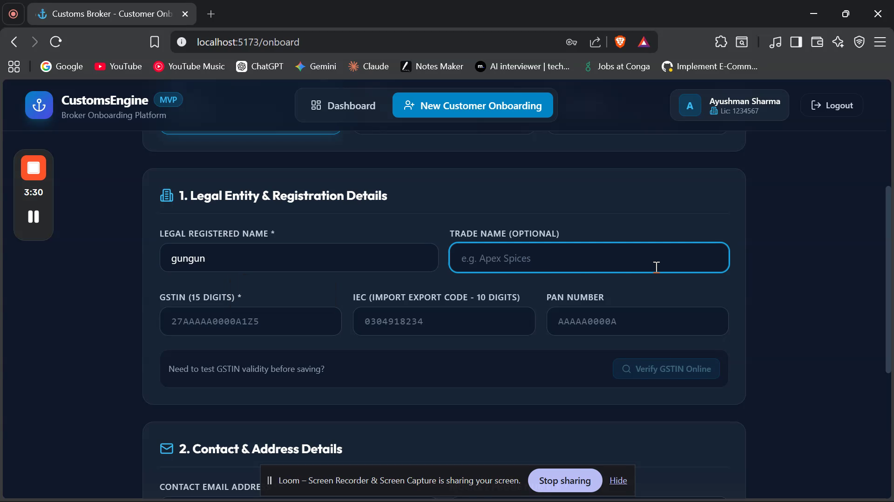
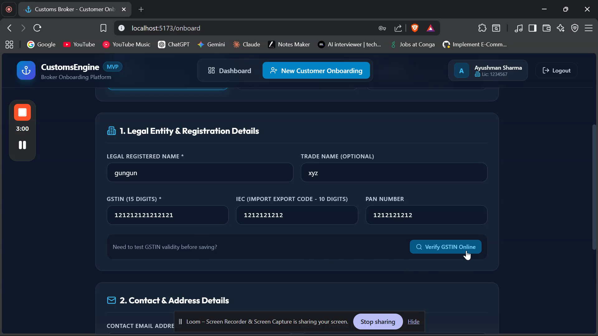
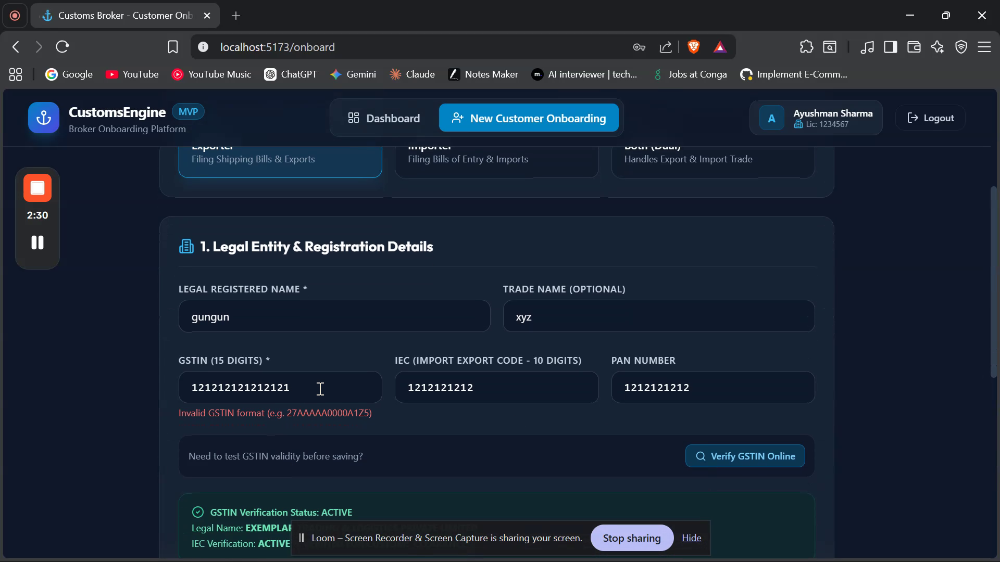
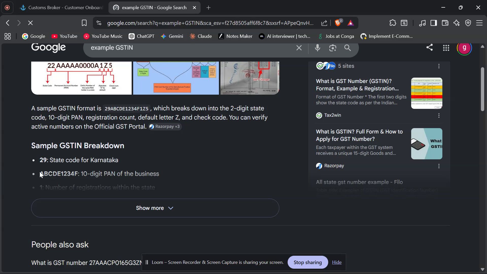
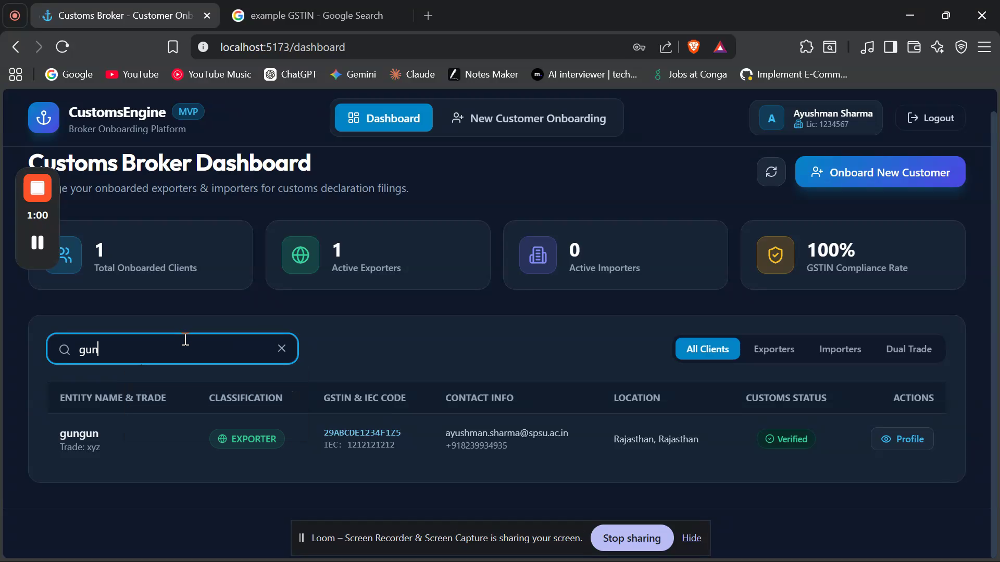

# End-to-End Customer Onboarding Workflow MVP

A full-stack, enterprise-grade web application designed for **Customs Brokers** to onboard, verify, and manage their Exporters & Importers clients for filing customs declarations (Bills of Entry / Shipping Bills) on their behalf.

---

## 🎥 Working Demo Video

A complete walkthrough video demonstrating registration, client onboarding, GSTIN verification, dashboard management, and system administration is included in the project repository:

▶️ **[Watch Application Demo Video (MP4)](<./Intro. video/a229042ad1be4339be964cf574fb111f.mp4>)**

---

## 📸 Application Screenshots

### 1. Broker Authentication & Password Strength Indicator



### 2. Customer Onboarding Form (Page 1) & Live Verification



### 3. Customs Broker Dashboard & Client Management




### 4. Admin Dashboard & Security Audit Feed



---

## 🏗️ Repository Architecture

The project is structured into two main decoupled applications alongside submission media assets:

```
customs-onboarding/
├── Intro. video/                  # Walkthrough video demonstration asset
│   └── a229042ad1be4339be964cf574fb111f.mp4
├── Screenshort/                   # Application UI & Database screenshots
│   ├── first_screenshot.png
│   ├── screenshot_2.png
│   ├── screenshot_3.png
│   ├── screenshot_4.png
│   ├── screenshot_5.png
│   ├── screenshot_6.png
│   ├── screenshot_7.png
│   ├── screenshot_8.png
│   └── screenshot_9.png
├── backend/                       # Node.js + Express + TypeScript + Prisma ORM API
│   ├── prisma/
│   │   ├── schema.prisma          # Database schema (PostgreSQL / SQLite ready)
│   │   └── seed.ts                # Database seed script for test data
│   ├── src/
│   │   ├── controllers/           # Auth, Customer & Admin business logic
│   │   ├── middleware/            # Auth JWT guard, Zod validation
│   │   ├── routes/                # Express API endpoints
│   │   ├── db/                    # Prisma Singleton Client
│   │   └── server.ts              # API server entry point
│   └── package.json
├── frontend/                      # React (Vite) + Tailwind CSS SPA
│   ├── src/
│   │   ├── components/            # Navbar, ProtectedRoute, UI components
│   │   ├── context/               # AuthContext (JWT & User state)
│   │   ├── pages/                 # Login, Register, Dashboard, CustomerOnboarding, AdminDashboard
│   │   └── services/              # Axios API Client with interceptors
│   └── package.json
└── README.md                      # Comprehensive Architecture & Setup Guide
```

---

## 🔒 Security Architecture & Implementation

### 1. Secure Password Hashing (Bcrypt)
- Passwords are **never stored in plain text**.
- Utilizes `bcryptjs` with a **cost factor of 10** to hash user passwords before saving into the database.
- Provides resistance against brute-force attacks and rainbow table computations.

### 2. Authentication & Authorization (JWT)
- Stateless authentication using **JSON Web Tokens (JWT)**.
- Secure HTTP Bearer header verification for protected routes (`/api/customers` and `/api/admin`).
- Role-based authorization separating `BROKER` users from system `ADMIN` users.

### 3. Strict Input Validation & Sanitization
- API request payloads (body, query, params) are parsed and validated using **Zod schemas**.
- Strictly enforces standard Indian **GSTIN format** (`15-character regex check`) and **IEC (Import Export Code)** requirements.
- Prevents invalid or malformed data from reaching database layers.

### 4. Database Safety
- Built on top of **Prisma ORM** which uses parameterized queries under the hood, eliminating **SQL Injection** vulnerabilities.

---

## 🗄️ Database Schema Details

The application supports **PostgreSQL** in production (and includes pre-configured SQLite compatibility for portable out-of-the-box local testing).

```prisma
model User {
  id              String     @id @default(uuid())
  name            String
  email           String     @unique
  password        String     // Bcrypt Hash
  role            String     @default("BROKER") // BROKER or ADMIN
  brokerLicenseNo String?
  companyName     String?
  phone           String?
  createdAt       DateTime   @default(now())
  customers       Customer[]
}

model Customer {
  id           String   @id @default(uuid())
  brokerId     String
  broker       User     @relation(fields: [brokerId], references: [id])
  name         String   // Company / Legal Name
  tradeName    String?
  email        String
  phone        String
  customerType String   // EXPORTER, IMPORTER, or BOTH
  gstin        String   // 15-character GSTIN
  iec          String?  // 10-character Import Export Code
  pan          String?
  address      String
  city         String
  state        String
  pincode      String
  status       String   @default("VERIFIED")
  createdAt    DateTime @default(now())
}
```

---

## 🚀 Quick Start Guide

### Prerequisites
- Node.js (v18+)
- npm (v9+)

### 1. Setting Up the Backend API

```bash
cd backend

# Install dependencies
npm install

# Push Prisma Database schema (creates SQLite / PostgreSQL tables)
npx prisma db push

# Seed initial test data (Broker & Admin & sample clients)
npm run db:seed

# Start Development API Server
npm run dev
```
The Backend API will start at `http://localhost:5000`.

### 2. Setting Up the Frontend Application

In a separate terminal tab:

```bash
cd frontend

# Install dependencies
npm install

# Start Vite Development Server
npm run dev
```
The Frontend Web App will start at `http://localhost:5173`.

---

## 🔑 Demo Test Credentials

The database comes pre-seeded with two accounts for easy testing:

| Role | Email | Password |
| :--- | :--- | :--- |
| **Customs Broker** | `broker@customsbroker.com` | `Password@123` |
| **System Admin** | `admin@customsbroker.com` | `Admin@123456` |

---

## 🌐 Key API Endpoints

| Method | Endpoint | Access | Description |
| :--- | :--- | :--- | :--- |
| `POST` | `/api/auth/register` | Public | Register new Customs Broker with bcrypt password hash |
| `POST` | `/api/auth/login` | Public | Authenticate user and issue JWT token |
| `GET` | `/api/auth/me` | Authenticated | Fetch current user profile |
| `POST` | `/api/customers` | Broker | Onboard new Exporter/Importer customer to DB |
| `GET` | `/api/customers` | Broker | List all clients onboarded by broker with search/filters |
| `POST` | `/api/customers/verify-gstin` | Broker | Mock GSTIN & IEC clearance portal verification |
| `GET` | `/api/admin/overview` | Admin Only | Platform-wide stats and security audit logs |
| `GET` | `/api/admin/users` | Admin Only | List all registered broker accounts |
